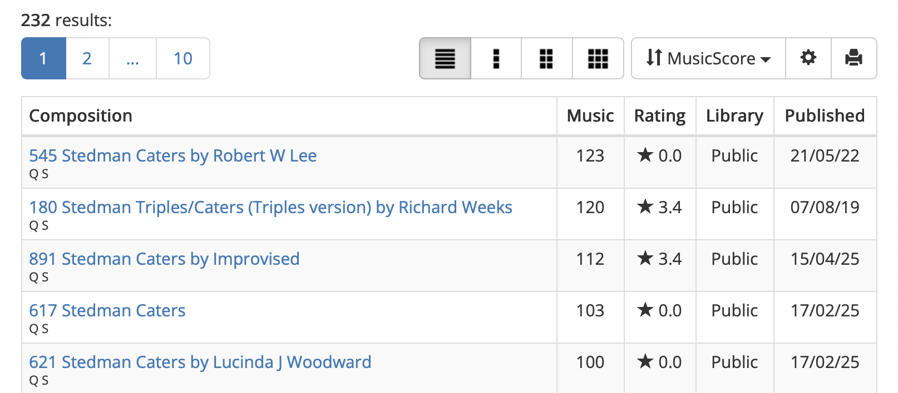
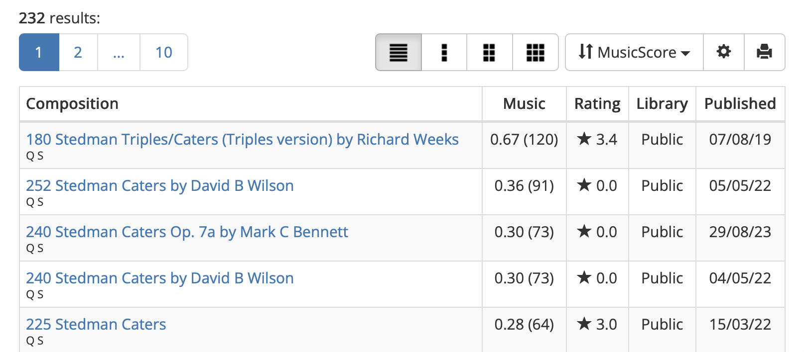
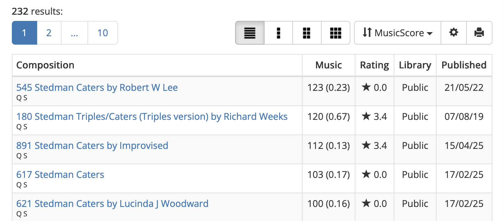

# Complib music ratio display

This is a Userscripts plugin for making Complib show a *music ratio* next to the Music score.

Music ratio is just the average music score per row (think of it as 'bang for your buck'):

```
                        music score
       music ratio =  ---------------
                       number of rows
```

# Example

Here's some complib search results without the plugin (sorted by MusicScore):



With the plugin installed, when sorting by MusicScore, the Music column shows (and sorts) the ratio; the music score is now shown in bracket:



If you click the Music header, we toggle back to sorting by music score, (but the music ratio is still shown in brackets):



Note: if you sort results by something other than MusicScore, no ratio will appear on the page.

# Installation

First you must install the Userscripts helper for whatever browser you run. 

Then you must install the plugin by copying the `complib-add-music-ratio.js` to the appropriate folder on your machine (the Userscripts helper will detail where).

## Installation example: Mac OS

1. Searching for 'userscripts' in the App Store and install it.

2. Download the file `complib-add-music-ratio.js` from this repo and place it in `~/Library/Containers/com.userscripts.macos.Userscripts-Extension/Data/Documents/scripts`.

